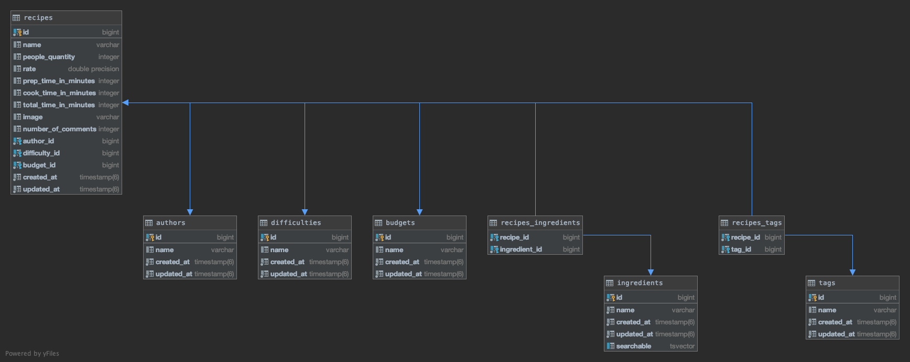

# hungry

## About

A simple application that helps users find a recipe that they can prepare with what they have at home.

## Preview


## Prerequisites
- Github
- Ruby 2.7+
- Rails 6+
- PostgreSQL 12+
- Node 14+
- npm 6+

## Install

### Clone the repository

```shell
git clone git@github.com:plaftsis/hungry.git
cd hungry
```

### Install dependencies

Using [Bundler](https://bundler.io/) and [npm](https://www.npmjs.com/):

```shell
bundle install
cd client
npm install
cd ..
```

### Initialize the database

```shell
bin/rails db:create db:migrate
rake copy:authors copy:difficulties copy:budgets copy:recipes copy:ingredients copy:tags copy:recipes_ingredients copy:recipes_tags
```



### Running tests

```shell
bin/rails db:migrate RAILS_ENV=test
rspec spec/
```

## Usage

### Start server
```shell
bin/rails dev:cache
bin/rails server -p 8000
```

### Start client
```shell
cd client
npm start
```

Visit [http://localhost:3000](http://localhost:3000) to see the application in action.

## License
[MIT](https://choosealicense.com/licenses/mit/)